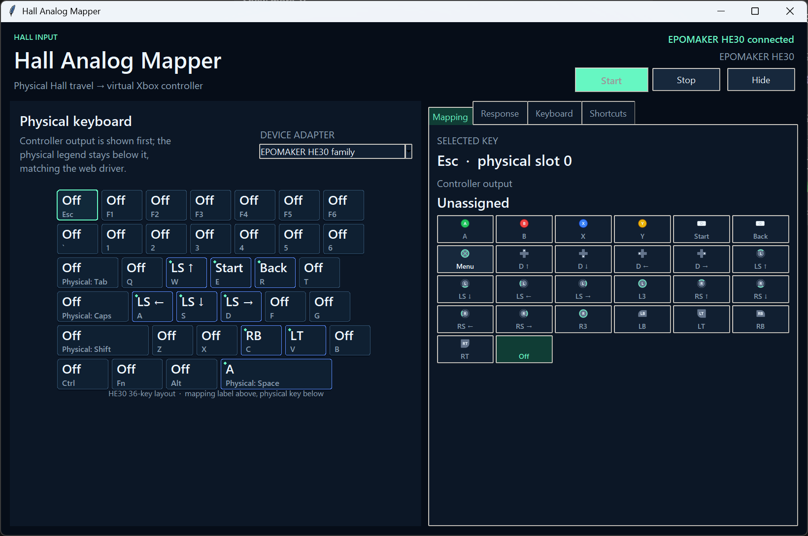
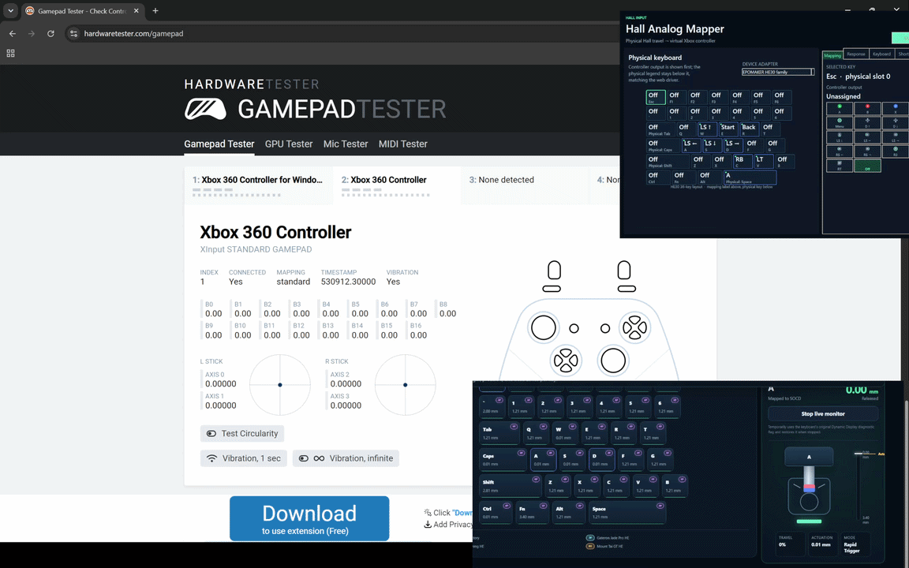

# Hall Analog Mapper

A modular Windows tray application that converts Hall-effect keyboard travel
into a virtual Xbox 360 controller.

The first built-in adapter supports the EPOMAKER HE30 keyboard. Additional brands
can be added without changing the mapper service, controller output, tray, or
user interface.

## Features

- Automatic detection across installed keyboard adapters.
- Proportional keyboard visualization derived from the HE30 web driver:
  controller mapping as the primary label, physical key as the secondary label,
  selection glow, mapped-key marker, and live Hall-travel fill.
- Per-key mappings for both sticks, both analog triggers, face buttons, bumpers,
  D-pad directions, Start/Back, and stick clicks.
- A responsive 26-action controller grid: 25 supplied icons (including the
  corrected Menu/Guide action) plus a text-only Unassigned action.
- Optional global shortcuts to start/stop mapping or completely exit the app
  while its window is hidden.
- Separate mapping sets for each keyboard adapter.
- Linear, gentle, S-curve, and fast response curves.
- Configurable raw deadzone, full-travel value, sensitivity, and digital-button
  threshold.
- Wootility-style **Enable keyboard keys** and **Gamepad mapping override**
  policy controls, applied only by adapters that safely support them.
- Automatic reconnect, safe temporary-state restoration, and background tray
  operation.
- Per-user configuration in `%APPDATA%\HallAnalogMapper\config.json`.
- Migration from the previous `%APPDATA%\HE30AnalogMapper\config.json`.

## Supported keyboards

| Adapter | Auto detection | Hall input | Profiles/layers | Digital-output policy |
| --- | --- | --- | --- | --- |
| EPOMAKER HE30 (`19F5:FB4C`) | Yes | Yes | Yes | Not exposed safely by known firmware |

The HE30 protocol cannot safely implement typing suppression: its `0xA0` Hall
report identifies the key using the key's current mapping triplet. Temporarily
unmapping several keys would make their analog reports indistinguishable. The UI
therefore saves the requested policy and reports the limitation instead of
pretending it works or installing a system-wide Windows keyboard hook.

Future adapters can implement the same policy through their own firmware:

- **Enable keyboard keys off:** the target keyboard stops producing ordinary
  typing events.
- **Gamepad mapping override on:** only controller-bound physical keys stop
  producing typing events.

## Requirements

- 64-bit Windows 10 or Windows 11.
- The ViGEmBus virtual-controller driver installed separately.
- Python 3.11-3.14 when running from source.
- A supported normal-mode Hall-effect keyboard interface.

The app calls the bundled 64-bit `ViGEmClient.dll` directly. Its build process
does not install or modify a kernel driver. ViGEmBus has been retired and its
repository is archived, so review the project notice before installing it.

## Run from source

Install ViGEmBus deliberately from its
[official release page](https://github.com/nefarius/ViGEmBus/releases), then:

```powershell
python -m venv .venv
.\.venv\Scripts\python.exe -m pip install -r requirements.txt
.\.venv\Scripts\python.exe HallAnalogMapper.py
```

On first launch:

1. Leave **Device adapter** on **Auto detect**.
2. Select a physical key on the visual keyboard.
3. Choose its Xbox controller output.
4. Adjust response settings if needed.
5. Press **Start**.
6. Close the window to continue mapping from the notification area.

The default HE30 mapping assigns `W/A/S/D` to the left stick, `Q/E` to LT/RT,
and Space to Xbox A.

The main window uses a fixed keyboard-and-sidebar layout: select a physical key
on the left, then assign it from the Mapping tab on the right. Response,
keyboard-output, and shortcut settings swap in the same sidebar, so key mapping
does not require scrolling away from the keyboard.

**Button threshold** applies only to digital controller actions. At `0.45`, a
mapped face button, bumper, D-pad direction, Start/Back, Menu/Guide, or stick
click turns on at 45% processed travel and releases below it. Analog sticks and
triggers keep their continuous values. Deadzone, curve, and sensitivity are
applied before the threshold comparison.

## Background behavior

- Closing the window hides it instead of stopping the mapper.
- The tray menu can open, start, stop, or exit the application.
- Shortcuts registered in **App shortcuts** work while the app is in the tray.
  They use the Windows hotkey API and do not install a keystroke-recording hook.
- Stopping releases all virtual controls and asks the active adapter to restore
  every temporary keyboard setting.
- Disconnecting a keyboard resets controller output and resumes auto detection.
- `--headless` runs the same registry/service pipeline without the window.

## Adding another keyboard

See [Adding another Hall-effect keyboard](docs/ADDING_KEYBOARD.md) and the
copyable [adapter template](examples/keyboard_adapter_template/).

A contributor supplies only:

1. `layout.py` — rows, key IDs, labels, and widths;
2. `protocol.py` — device matching, connect/prepare/read/cleanup logic translated
   from the manufacturer's WebHID implementation; and
3. `adapter.py` — thin protocol glue plus raw Hall-to-`0.0..1.0` conversion.

The registry discovers `ADAPTER_CLASS` automatically. The shared UI immediately
renders the new layout and auto detection tries it in priority order.

## Build

```powershell
.\build.cmd
```

`build.cmd` launches the PowerShell build with a process-only execution-policy
bypass, so it also works on systems where direct `.ps1` execution is disabled.

The windowed executable is created at:

```text
dist\HallAnalogMapper.exe
```

The PyInstaller recipe bundles the user-space ViGEm client and discovers all
keyboard adapter submodules. It never runs the ViGEmBus installer.

## Tests

```powershell
$env:PYTHONDONTWRITEBYTECODE = "1"
python -m unittest discover -s tests -v
```

The tests cover report decoding, profile/layer events, mapping resolution,
temporary HE30 flag restoration, raw conversion, adapter auto detection,
per-keyboard configuration isolation, global-hotkey parsing, response curves,
and XInput reports.

## Performance design

- HID reading and controller output run on a dedicated worker thread; Tk drawing
  and tray interaction stay on the main UI thread.
- Settings are cloned only when the user changes them. The report loop reads a
  versioned snapshot instead of serializing the whole config per Hall sample.
- High-rate telemetry remains full speed for controller output, while UI samples
  are coalesced by physical key and Canvas redraws are limited to display rate.
- Controller reports are skipped when the computed XInput state is unchanged.
- The interface has no vertically scrolling application canvas; the keyboard is
  fixed and settings switch through a responsive sidebar.

The app deliberately leaves processor affinity under the Windows scheduler.
Pinning a lightweight, mostly I/O-bound process away from cores 0/1 usually adds
context-switch and power-management costs without lowering input latency.

Tk 8.6 draws widgets and Canvas content through CPU/GDI rendering and has no
hardware-acceleration switch. Windows still GPU-composites the finished window,
but migrating the widget tree to WebView2 or Qt Quick would be a separate UI
rewrite. The app opts into Windows DPI-aware rendering to avoid bitmap scaling;
the fixed layout and refresh batching remove the expensive rapid-scroll path
without adding a large browser or Qt runtime.

## Custom application icon

Place a square PNG at `images/icon.png` before building. The app uses it for the
window, notification area, and Windows executable icon. A transparent image of
at least 256×256 is recommended. Missing or invalid artwork uses the generated
window/tray icon and leaves the executable with its default build icon.

## HE30 safety behavior

The HE30 adapter uses only normal configuration interfaces. Firmware/updater and
bootloader identifiers are not included.

On start it:

1. reads the active profile and all mapping banks;
2. reads each profile's 64-byte configuration;
3. enables config byte 7 bit 3 only when needed;
4. verifies that change by reading it back; and
5. clears only the flags this process enabled when stopping.

Other configuration bytes are preserved. See [HE30 protocol notes](docs/PROTOCOL.md).

## Project structure

| Path | Purpose |
| --- | --- |
| `he_keyboard_mapper/keyboards/base.py` | Stable adapter, layout, event, and capability contracts |
| `he_keyboard_mapper/keyboards/registry.py` | Adapter discovery and automatic connection |
| `he_keyboard_mapper/keyboards/he30/` | HE30 layout, protocol, conversion, and capability implementation |
| `he_keyboard_mapper/service.py` | Brand-independent reconnect and mapping worker |
| `he_keyboard_mapper/controller.py` | Response curves, aggregation, and direct ViGEm output |
| `he_keyboard_mapper/hotkeys.py` | Global shortcut parsing and Windows registration |
| `he_keyboard_mapper/ui/theme.py` | Central colors, fonts, and ttk styles |
| `he_keyboard_mapper/ui/assets.py` | Optional `images/icon.png` discovery and loading |
| `he_keyboard_mapper/ui/keyboard_view.py` | Reusable proportional keyboard canvas |
| `he_keyboard_mapper/ui/controller_grid.py` | Responsive 26-action icon picker |
| `he_keyboard_mapper/ui/hotkey_recorder.py` | Key-combination recording control |
| `he_keyboard_mapper/ui/widgets.py` | Reusable switches and scrolling components |
| `he_keyboard_mapper/ui/app.py` | Window composition and UI event wiring |
| `controller_icons/` | Lightweight PNG renderings of the source SVG controller icons |
| `examples/keyboard_adapter_template/` | Copyable integration skeleton |
| `tests/` | Hardware-independent regression tests |

## License

MIT. The bundled ViGEm client binary is attributed separately in
[`vendor/README.md`](vendor/README.md).
